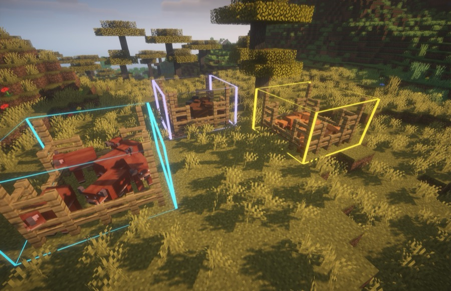
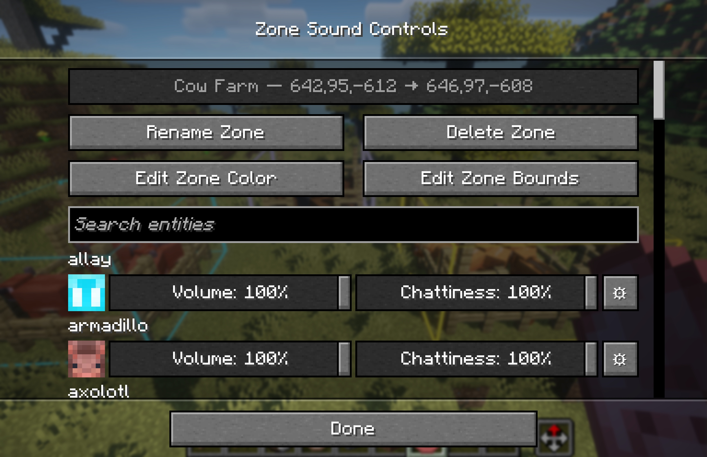
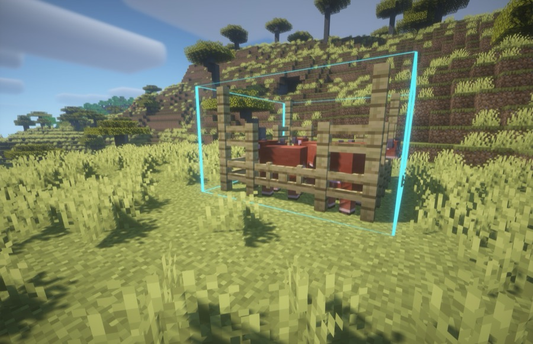
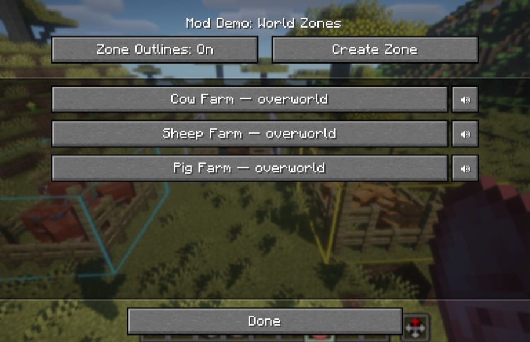

   
   
   

# Noisy Neighbors

**Enjoy Minecraft's sounds everywhere... except the ones that wear out their welcome.**

Noisy Neighbors is a client-side Minecraft mod for players who want a peaceful base without making the rest of the world feel silent. Turn down a crowded cow farm, make villagers less chatty, or quiet a pet-filled house while keeping normal sounds everywhere else.

Give each catalogued vanilla mob its own **Volume** and **Chattiness** setting, then create coloured 3D sound zones for places such as animal farms, trading halls, mob grinders, and stables. It works in single-player and on multiplayer servers with no server installation.

  

## What you can do

- Set the volume of each catalogued vanilla mob from 0–100%.
- Set how often a mob's catalogued sounds are allowed to play with **Chattiness**.
- Quickly search through a list of all vanilla mobs.
- Fine-tune individual sound events with **Advanced Volume Controls**.
- Create named, coloured sound zones by quickly and easily creating in-game cubes.
  - Apply different volume and chattiness settings inside each zone.
- Keep all settings local to your client and separate zones by world/server.

## Quick start

1. Install Noisy Neighbors, [Fabric Loader](https://fabricmc.net/), and Fabric API for Minecraft 26.3.
2. In Minecraft, open **Options → Music & Sound → Advanced Sound Controls**.
3. Search for a mob, then set its **Volume** and **Chattiness** sliders.
4. To quiet only part of a world, choose **Edit World Zones** and create a zone.

Noisy Neighbors is entirely client-side. Install it once on your own client; it works in single-player, Realms-style multiplayer, and ordinary vanilla or modded servers without requiring anyone else to install it.

## Hotkeys

All Noisy Neighbors hotkeys can be changed in Minecraft's **Controls** menu:

- **Z — Create Zone** — start a two-corner zone selection; press it again to cancel.
- **U — Open World Zones** — open the zone manager for the current world.
- **K — Toggle Zone Outlines** — show or hide saved zone boundaries.

## Volume, chattiness, and advanced controls

Every mob has two simple controls:

- **Volume** changes how loud its catalogued sounds are.
- **Chattiness** changes how often those sounds start. At 100%, every matching sound plays normally; at 50%, approximately half play; at 0%, matching sounds are silent.

Use **⚙ Advanced Volume Controls** beside a mob when one particular sound needs different treatment. For example, you can lower a villager's ambient chatter while leaving its trade sound louder. Advanced controls are available only for sound events that Noisy Neighbors can confidently associate with that mob.

Global settings are your default everywhere. Zone settings apply on top when a sound originates inside that zone, so a cow farm can be quiet while cows outside remain normal. If zones overlap, their settings combine.

  

## Create a sound zone

Use a sound zone whenever you only want a location to be calmer—an animal farm, mob grinder, trading hall, stable, or pet room.

1. Open **Options → Music & Sound → Advanced Sound Controls → Edit World Zones**.
2. Select **Create Zone**.
3. Right-click two opposite corner blocks to set its bounds. The action bar guides you through the selection.
4. Open the new zone and adjust the mobs' **Volume**, **Chattiness**, or individual sound-event volume.

Press your configured **Create Zone** key again while selecting corners to cancel.

  

## Manage zones quickly

Open Minecraft's **Controls** menu and look under **Noisy Neighbors** to configure these shortcuts:

- **Create Zone** — start or cancel a two-corner selection.
- **Open World Zones** — manage zones for the current world.
- **Toggle Zone Outlines** — show or hide zone boundaries.

From a zone's screen, you can rename it, change its outline colour, edit its bounds, or delete it.

  

## What Noisy Neighbors changes

Noisy Neighbors changes only its catalogued vanilla mob sounds. Player, block, unknown, and modded sounds continue to use Minecraft's normal audio behaviour. Some sounds shared by several entities cannot be safely attributed on a client-only installation and are left alone unless Minecraft provides their source.

Settings are stored locally in `config/noisy-neighbors.json`.

## Requirements

- Minecraft Java Edition 26.3
- Fabric Loader 0.19.5
- Fabric API 0.161.0+26.3
- Java 25 or newer

## Contributing

Looking to contribute? See [CONTRIBUTING](CONTRIBUTING.md).

## License

MIT. See [LICENSE](LICENSE).
